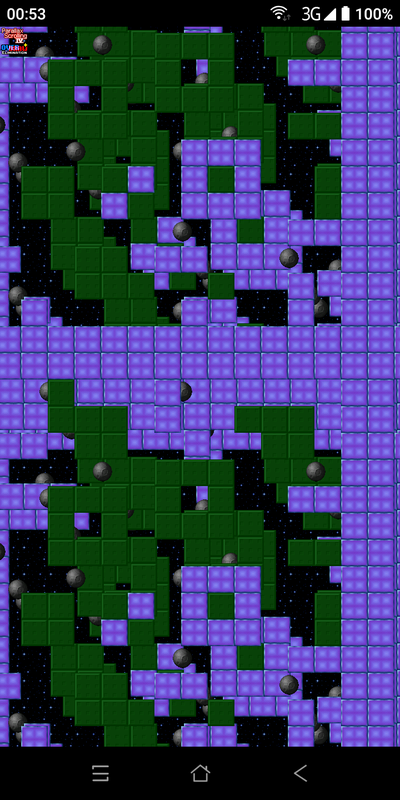

# SDL2-Android-Example
SDL2 Example for Android, C/C++ template build tree.

Requires Android NDK and android SDK Tools.
Setup PATH to SDK and NDK in "local.properties" file
<pre>
sdk.dir=/home/user/ANDROID/ASDK
ndk.dir=/home/user/ANDROID/NDK	
</pre>
Prepare SDL2 projects libraries - see link:
[a link](https://github.com/AlexanderAgd/SDL2-Android)
and copy "lib" with your SDL2 compiled libraries to folder "app/cpp/lib". 
Connect your Android device with "Developer mode" on and run command
<pre>
./gradlew installDebug
</pre>

